# Hi there, I'm Federico 👋

## 📚 About Me
- 🎓 Master's student specializing in **Quantum Computing, HPC, and Parallel Programming**
- 🚀 Exploring **Quantum Algorithms**, GPU acceleration, and large-scale computation
- 🧑‍💻 Passionate about solving complex computational problems with efficient and scalable solutions
- 🌐 Always eager to learn and collaborate on impactful projects

---

## 🛠️ Tech Stack

### 🚀 Languages & Frameworks

   
   
   
   
   
   
   
  

### 🛠️ Tools & Platforms

   
   
   
   
  

---

## 📈 GitHub Overview

### 🚀 My Language Usage
Here's an overview of my most used programming languages in repositories:

---

### ⏳ Weekly Coding Stats (via WakaTime)
My coding activity across different projects, tracked through WakaTime:

---

### 📊 My Coding Habits
Analyzed from my recent commit history, showing activity distribution across days and hours:

---

### 🌟 Starred Topics
Currently exploring repositories in various domains. Check out topics from my starred repositories:

### 🗓️ Contribution Calendar
Visual overview of my coding contributions this year:

---

## 📫 Let's Connect!

  
  

